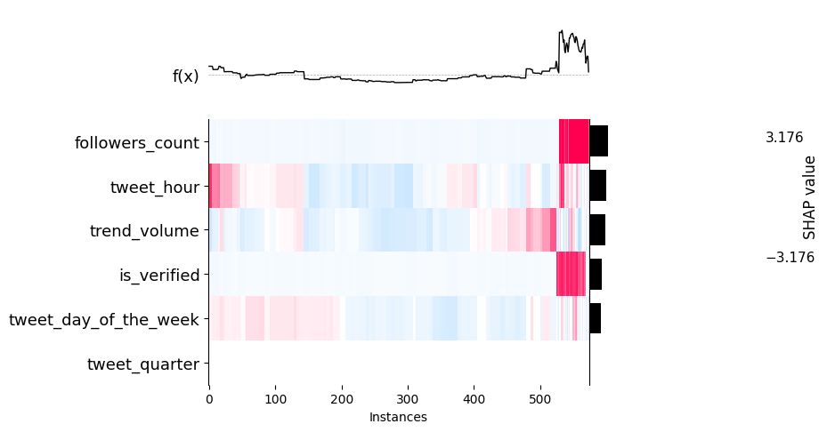
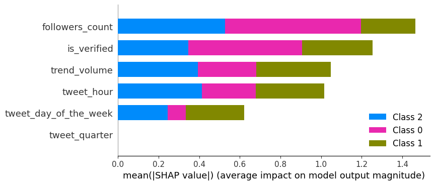

# Tweets popularity prediction

### I- Dataset Collection
* Dataset is collected __manually__ based on trends in day-to-day.
* Trends list are created dynamically, by querying the Twitter API
* Fetch Data by using fetch_data packages in script folder 

### II- Features selected for baseline

* __Features selected :__
  * tweet_day_of_the_week
  * tweet_hour
  * __is_verified__
  * __followers_count__

We try to keep things simple for this first version 

### III- Target : Predict viral tweet

* Predict if a tweet will be viral 

__Note__ : Model is NOT based on the tweet itself
  
* We define 2 levels of virality : 
  * number of fav < 100 => non viral tweets => mapped to 0
  * Number of fav > 100 =>  viral tweets => mapped to 1

### IV- __Baseline result__

* Yeah the data is unbalanced and that is quite logic :)
* We oversample the __training set_ resulting to an improvement of f1_score on class 1

 ```
              precision    recall  f1-score   support

           0       1.00      0.99      0.99      1704
           1       0.79      0.98      0.87        83

    accuracy                           0.99      1787
   macro avg       0.89      0.98      0.93      1787
weighted avg      0.99      0.99      0.99      1787

  ```
### V- Interpretability : SHAP Explainer


* __Inference__

  
* __Features importances__


The number of followers and the verified tag are the most important features to solve this classification problem (quite logic again)